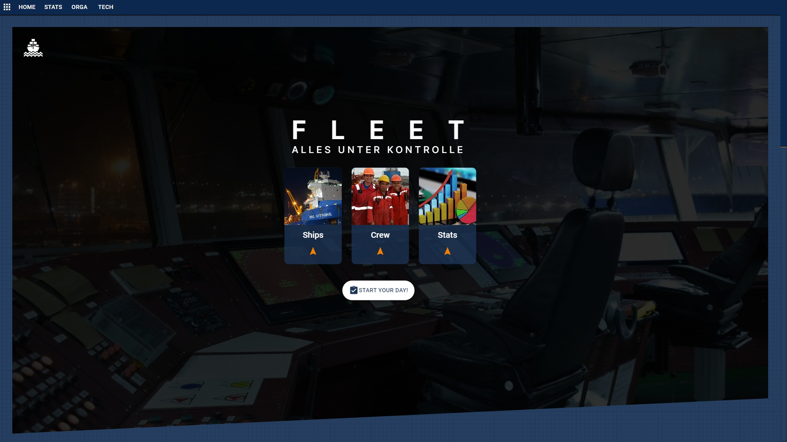
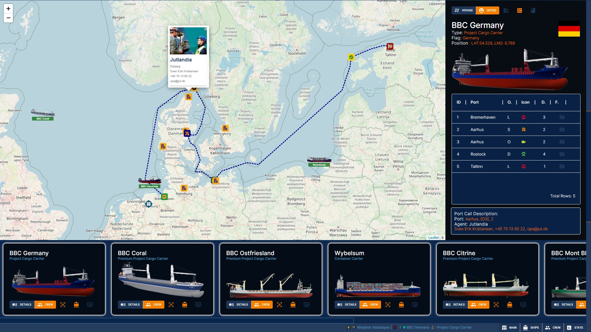
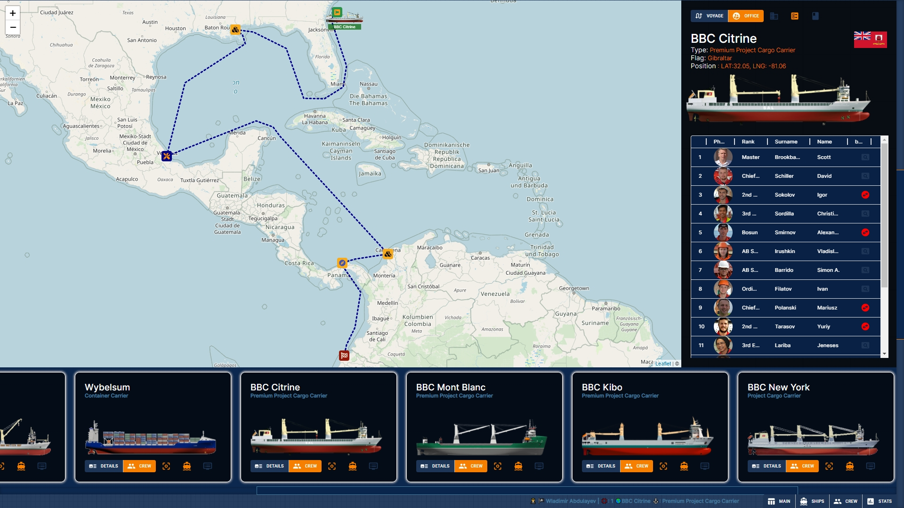
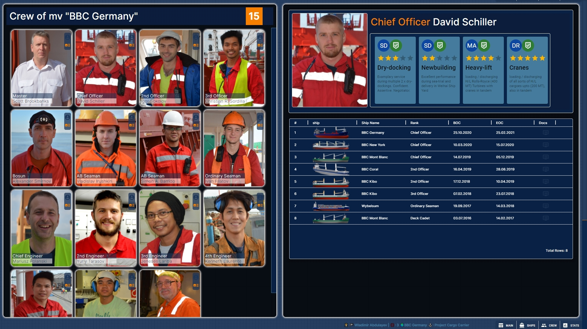
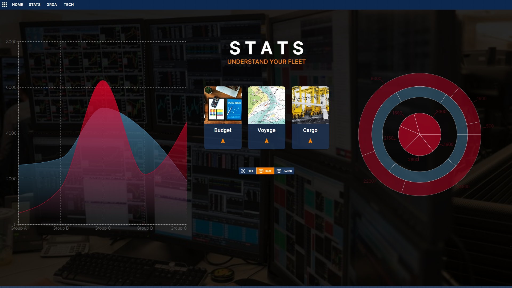

# Fleet (Flotte)

Fleet (Flotte) is a prototype of interactive PWA for Fleet Management featuring fleet, voyage (including AIS positions), crew overviews.
It also contains a section for graphical presentation of statisctical and analytical data.

# How does it work?

In the dashboard you find vessels of the fleet, interactive map and details section.
You can locate any vessel on the map, display voyage and voayge details.
After selecting a particular vessel you get access to additional features such as crew overview, vessel fetails, office staff etc.

<h1 style="text-align: center">Landing</h1>

Select the section of the Application

  

&nbsp;
&nbsp;

<h1 style="text-align: center">Main</h1>

Select the ship

<li>display voyage</li>
<li>display voyage details</li>
<li>show voyage on the map</li>
<li>display office staff</li>
<li>display crew</li>
<li>agent network</li>

  	 
    

&nbsp;
&nbsp;

<h1 style="text-align: center">Crew</h1>

Full Crew Overview

<li>display crewmember details</li>
<li>skills section</li>
<li>sea-going records</li>

    

<h1 style="text-align: center">Stats</h1>

Fleet and vessel statistics and analytics

    

&nbsp;
&nbsp;

# Author:

- **[Wladimir Abdulayev](https://github.com/WladimirAbdulayev)**
